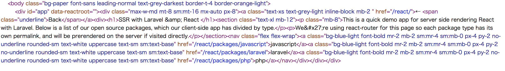

* https://qiita.com/IganinTea/items/aec8f2b15b203946a2c4
* https://github.com/iga-yamaguchi/php-docker-sample

Dockerは上記環境を参考にしました。

* https://github.com/spatie/laravel-server-side-rendering-examples

laravelは上記環境を元に作成しました。


## 環境構築
```bash
git clone ???
cd ???

docker-compose build
docker-compose up

// up後PHPコンテナの中に入る
docker-compose exec php bash

cd sample
composer install

// libpng-devがlinux os上になくpngquant-binのインストールが失敗するためlibpng-devを別途インストールする
// どの箇所で画像圧縮しているのか不明, そもそもいらない気がする
apt-get install libpng-dev

npm install
npm run production

// /usr/local/bin/にnodeファイルがある必要があるみたい（v8jsは使っていない...?）
// この環境では/usr/binにnodeファイルがあるため, シンボリックリンクを作成する
ln -s /usr/bin/node /usr/local/bin/node
```

* `http://localhost:8080/`
* `http://localhost:8080/react`

にアクセスし、表示されればOK

## SSR表示確認
`.env`ファイルの`APP_ENV`の値を`production`に変更する（変更したものはCommit済み）

するとSSRされるらしい

`view-source:http://localhost:8080/react`を開き
```html
<div id="app"></div>
```
にHTMLが挿入されている状態か確認する。挿入されていればSSRされている。




## DBマイグレーション(SSRの動作確認までならマイグレーションしなくてもいいかも)
```
docker-compose exec php php ./sample/artisan migrate
```


## 上記マイグレーション実行で「SQLSTATE[HY000] [2054] The server requested authentication method unknown to the client のエラー表示される場合

https://symfoware.blog.fc2.com/blog-entry-2160.html
